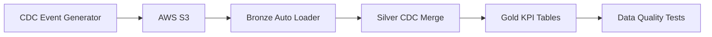
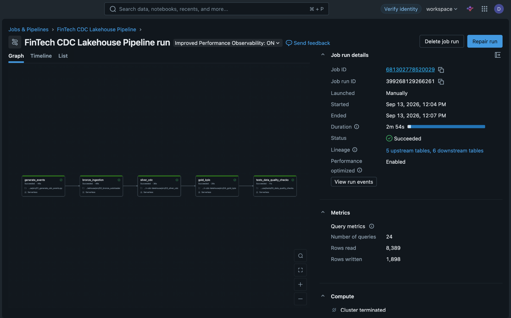
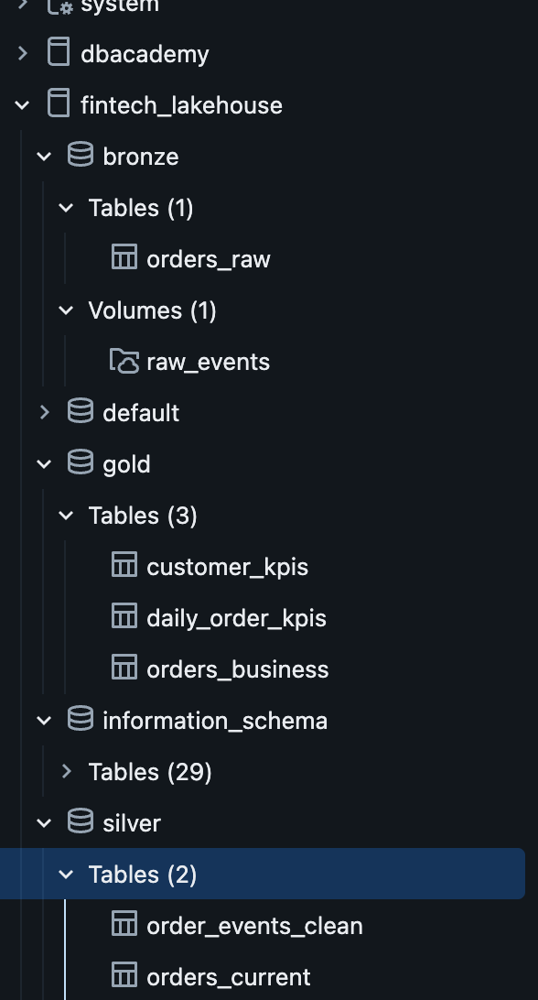
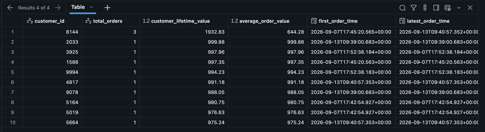
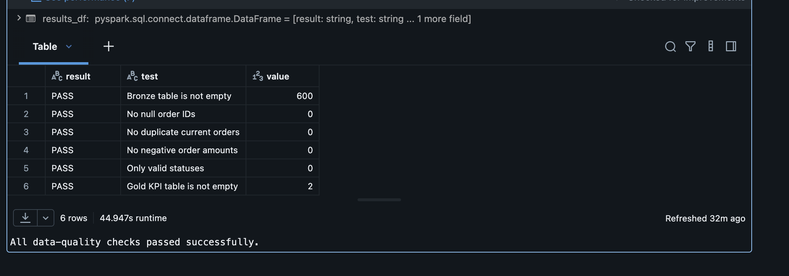

# End-to-End E-commerce CDC Lakehouse

A production-style data engineering portfolio project that processes simulated e-commerce order changes using AWS S3, Databricks, PySpark, Delta Lake, Auto Loader and Unity Catalog.

The project demonstrates incremental ingestion, CDC-style upserts, Medallion Architecture, business KPI generation, workflow orchestration and automated data-quality validation.

## Architecture


## Pipeline Screenshots

### Successful Workflow
All five tasks completed successfully.



### Catalog Structure
Bronze, Silver and Gold tables in Unity Catalog.



### Gold Customer KPIs
Customer aggregates from simulated order data.



### Data Quality Checks
All six implemented checks passed.



## Project Overview

The pipeline simulates transactional order events such as:

* `INSERT` — a new order is created
* `UPDATE` — an existing order changes
* `CANCEL` — an order is cancelled

The events are written as JSON files to AWS S3 and processed through Bronze, Silver and Gold layers in Databricks.

## Technology Stack

* Databricks
* Apache Spark
* PySpark
* Delta Lake
* Databricks Auto Loader
* Unity Catalog
* AWS S3
* AWS IAM
* Databricks Workflows
* GitHub

## Pipeline Layers

### Source Layer

The source notebook generates simulated order events containing:

* Event ID
* Order ID
* Customer ID
* Event type
* Order status
* Order amount
* Sequence number
* Event timestamp

Each run creates a new batch of JSON events in an external Unity Catalog volume backed by AWS S3.

### Bronze Layer

The Bronze notebook uses Databricks Auto Loader with the `cloudFiles` source to ingest new JSON files incrementally.

Bronze processing includes:

* Incremental file discovery
* Schema inference
* Schema evolution
* Rescued-data support
* Source-file metadata
* File-modification timestamps
* Streaming checkpoints
* Append-only Delta storage

Bronze table:

```text
fintech_lakehouse.bronze.orders_raw
```

### Silver Layer

The Silver notebook cleans and validates the Bronze events.

Silver processing includes:

* Data-type conversion
* Required-field validation
* Invalid-amount filtering
* Event-type validation
* Event-ID deduplication
* Order-level sequencing
* Latest-record selection
* Delta Lake `MERGE` upserts
* Cancelled-order identification

Silver tables:

```text
fintech_lakehouse.silver.order_events_clean
fintech_lakehouse.silver.orders_current
```

`order_events_clean` preserves cleaned events, while `orders_current` provides the latest known state of each order.

### Gold Layer

The Gold notebook converts Silver data into business-ready datasets and aggregates.

Gold tables:

```text
fintech_lakehouse.gold.orders_business
fintech_lakehouse.gold.daily_order_kpis
fintech_lakehouse.gold.customer_kpis
```

The Gold layer provides:

* Total orders
* Successful orders
* Cancelled orders
* Total revenue
* Average order value
* Cancellation rate
* Unique customers
* Customer lifetime value
* First and latest order timestamps

## Databricks Workflow

The pipeline is orchestrated as a multi-task Databricks Workflow using serverless compute.

```text
generate_events
      ↓
bronze_ingestion
      ↓
silver_cdc
      ↓
gold_kpis
      ↓
data_quality_tests
```

Each task depends on the successful completion of the previous task.

## Successful Pipeline Run

The complete workflow successfully executed all five tasks.


Example run statistics:

| Metric                     |               Result |
| -------------------------- | -------------------: |
| Job status                 |            Succeeded |
| Tasks completed            |                    5 |
| Duration                   | 2 minutes 54 seconds |
| Rows read                  |                8,389 |
| Rows written               |                1,898 |
| Upstream tables detected   |                    5 |
| Downstream tables detected |                    6 |

## Automated Data-Quality Tests

The final workflow task validates that:

* The Bronze table is not empty
* Silver order IDs are not null
* The current-orders table has no duplicate order IDs
* Order amounts are non-negative
* Only accepted order statuses are present
* The Gold KPI table contains data

The assertions cause the workflow to fail if a quality rule is broken.

## Repository Structure

```text
fintech-cdc-lakehouse/
├── src/
│   ├── 01_generate_cdc_events.ipynb
│   ├── 02_bronze_autoloader.ipynb
│   ├── 03_silver_cdc.ipynb
│   └── 04_gold_kpis.ipynb
├── tests/
│   └── 05_data_quality_checks.ipynb
├── workflow-success.png
└── README.md
```

## Cloud Security

Databricks accesses AWS S3 using:

* An AWS IAM role
* A Unity Catalog storage credential
* An external location
* An External ID trust condition
* IAM role self-assumption

No AWS access keys, secret keys, Databricks tokens or passwords are stored in this repository.

## How to Run

Run the notebooks in this order:

```text
01_generate_cdc_events
02_bronze_autoloader
03_silver_cdc
04_gold_kpis
05_data_quality_checks
```

Alternatively, run the complete Databricks Job:

```text
FinTech CDC Lakehouse Pipeline
```

The workflow generates new events, incrementally ingests them, refreshes Silver and Gold tables, and executes the automated quality checks.

## Example Queries

### View current orders

```sql
SELECT *
FROM fintech_lakehouse.silver.orders_current
ORDER BY event_timestamp DESC;
```

### View daily KPIs

```sql
SELECT *
FROM fintech_lakehouse.gold.daily_order_kpis
ORDER BY order_date DESC;
```

### View high-value customers

```sql
SELECT *
FROM fintech_lakehouse.gold.customer_kpis
ORDER BY customer_lifetime_value DESC
LIMIT 10;
```

## Skills Demonstrated

* End-to-end data-pipeline development
* Cloud-storage integration
* IAM role-based access
* Streaming and incremental ingestion
* PySpark transformations
* Delta Lake transactions
* CDC-style upserts
* Data deduplication
* Medallion Architecture
* Business KPI modelling
* Data-quality testing
* Workflow orchestration
* Git-based version control
* Unity Catalog governance and lineage

## Current Limitations

* The source data is simulated rather than produced by a live transactional database.
* Auto Loader runs with an available-now trigger rather than continuously.
* Order cancellation is represented as a business status rather than a physical record deletion.
* The current implementation maintains cleaned event history and current order state; full SCD Type 2 validity intervals are planned as a future enhancement.

## Future Improvements

* Add a PostgreSQL source with AWS DMS
* Implement full SCD Type 2 customer history
* Add DLT/Lakeflow declarative pipelines and expectations
* Add schema-drift test events
* Implement dead-letter processing for invalid records
* Add rolling seven-day revenue and churn metrics
* Add dashboard visualisations
* Manage infrastructure using Terraform
* Deploy jobs using Databricks Asset Bundles
* Add GitHub Actions CI/CD
* Replace broad S3 access with a bucket-specific least-privilege policy
* Configure failure notifications and monitoring

## Author

**Purna Satish Dasari**
MSc Advanced Computer Science
Data Engineering Portfolio Project
