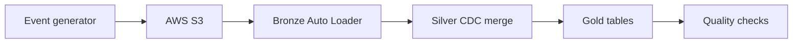

# E-commerce CDC Lakehouse

A data engineering portfolio project that processes simulated e-commerce order changes through Bronze, Silver and Gold layers using AWS S3, Databricks, PySpark and Delta Lake.

It demonstrates incremental ingestion, CDC-style upserts, data-quality checks, business aggregates and a five-task Databricks workflow.

> **Naming note:** This project was originally called FinTech CDC Lakehouse. Some screenshots show the earlier name, and the Unity Catalog namespace remains `fintech_lakehouse`.

## Architecture



## Pipeline Screenshots

The screenshots below document an earlier successful run. The project and job have since been renamed.

### Successful workflow


### Unity Catalog layers


### Gold customer KPIs


### Data-quality checks


## How the Pipeline Works

### Source

The generator writes batches of simulated JSON change events to an external Unity Catalog volume backed by AWS S3. Events contain an event ID, order ID, customer ID, event type, status, amount, sequence number and timestamp.

The simulated event types are `INSERT`, `UPDATE` and `CANCEL`. The source is a generator, not a live transactional database.

### Bronze: incremental ingestion

Databricks Auto Loader uses `cloudFiles` to discover and ingest new JSON files into the append-only Delta table `fintech_lakehouse.bronze.orders_raw`. The notebook records source metadata and uses schema evolution, rescued-data handling and streaming checkpoints.

### Silver: cleaned events and current order state

PySpark converts data types, validates events and removes duplicate event IDs. Order sequencing selects the latest known event for each order. Delta `MERGE` maintains the current order table.

| Table | Purpose |
| --- | --- |
| `fintech_lakehouse.silver.order_events_clean` | Cleaned order events |
| `fintech_lakehouse.silver.orders_current` | Latest known state of each order |

A cancellation is represented in the order state; it does not physically delete the order.

### Gold: business tables

| Table | Purpose |
| --- | --- |
| `fintech_lakehouse.gold.orders_business` | Order data prepared for reporting |
| `fintech_lakehouse.gold.daily_order_kpis` | Daily order and cancellation metrics |
| `fintech_lakehouse.gold.customer_kpis` | Customer order totals and averages |

The existing Gold calculation labels non-cancelled order value as `total_revenue`. The `customer_lifetime_value` column is accumulated simulated order value, not a predictive customer lifetime value model.

## Workflow and Validation

The **E-commerce CDC Lakehouse Pipeline** runs five dependent tasks on Databricks serverless compute:

```text
generate_events → bronze_ingestion → silver_cdc → gold_kpis → tests_data_quality_checks
```

The final task fails the job if any of its six checks fails. It checks for a non-empty Bronze table, non-null order IDs, unique current order IDs, non-negative amounts, accepted statuses and a non-empty Gold KPI table.

One documented successful run completed all five tasks in **2 minutes 54 seconds**. Databricks reported **8,389 rows read** and **1,898 rows written** across the run. These are execution metrics, not counts of unique orders. The screenshot above shows the run details; metrics may differ in later runs.

## SQL Analysis

The project also includes SQL window-function analysis:

- Customer ranking by accumulated order value using `DENSE_RANK()`.
- Daily order-value comparisons using `LAG()`. Changes are calculated only when dates are consecutive.

The daily comparison uses `fintech_lakehouse.gold.daily_order_kpis`. A missing date does not automatically mean there were zero orders on that day.

## Repository Layout

```text
src/             Event generation, Bronze, Silver and Gold notebooks
tests/           Data-quality notebook
sql/             Customer ranking and daily trend queries
resources/       Databricks job YAML
docs/images/     Pipeline screenshots
README.md        Project documentation
```

Notebook filenames and extensions are shown in the repository itself. The job YAML contains workspace-specific notebook paths that must be changed when setting up a different workspace.

## Running the Project

The project requires access to a Databricks workspace with Unity Catalog, the configured AWS S3 external location and the `fintech_lakehouse` catalog.

Run the notebooks in this order:

```text
01_generate_cdc_events
02_bronze_autoloader
03_silver_cdc
04_gold_kpis
05_data_quality_checks
```

Alternatively, run the **E-commerce CDC Lakehouse Pipeline** Databricks job. The YAML in `resources/` records its task configuration; committing that file to GitHub does not deploy or update the job.

## Example Queries

```sql
SELECT *
FROM fintech_lakehouse.silver.orders_current
ORDER BY event_timestamp DESC;
```

```sql
SELECT *
FROM fintech_lakehouse.gold.daily_order_kpis
ORDER BY order_date DESC;
```

```sql
SELECT *
FROM fintech_lakehouse.gold.customer_kpis
ORDER BY customer_lifetime_value DESC
LIMIT 10;
```

## Security

Databricks accesses S3 through an AWS IAM role, Unity Catalog storage credential and external location. The role uses an External ID trust condition. The repository does not need AWS access keys or Databricks tokens to describe the pipeline.

## Current Limitations

- The events are simulated and are not sourced from database logs.
- Auto Loader uses an available-now trigger rather than running continuously.
- The Silver layer maintains cleaned events and current order state; it does not implement SCD Type 2 validity intervals.
- Gold reports non-cancelled order value under a `total_revenue` column; payment completion is not independently verified.
- The current quality checks cover basic table and field conditions. CDC replay and out-of-order behaviour should be documented with committed tests before presenting them as automated workflow checks.

## Planned Improvements

- Add a PostgreSQL source and AWS DMS.
- Add CDC replay and out-of-order event tests to the automated workflow.
- Add invalid-record quarantine and schema-drift test events.
- Add a calendar-based seven-day rolling metric and a business dashboard.
- Replace broad S3 permissions with a bucket-specific policy.
- Add deployment automation and failure notifications.

## Author

**Purna Satish Dasari**  
MSc Advanced Computer Science  
Data Engineering Portfolio Project
